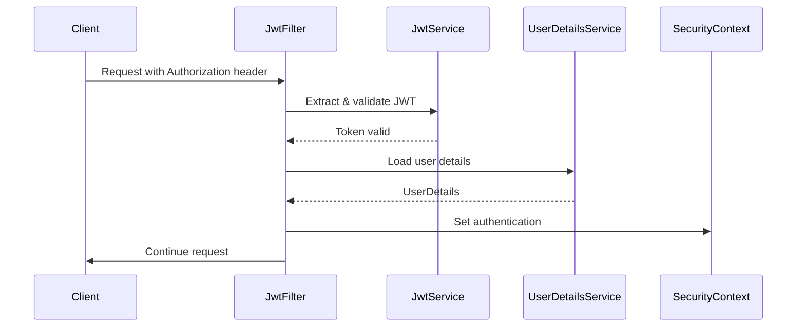
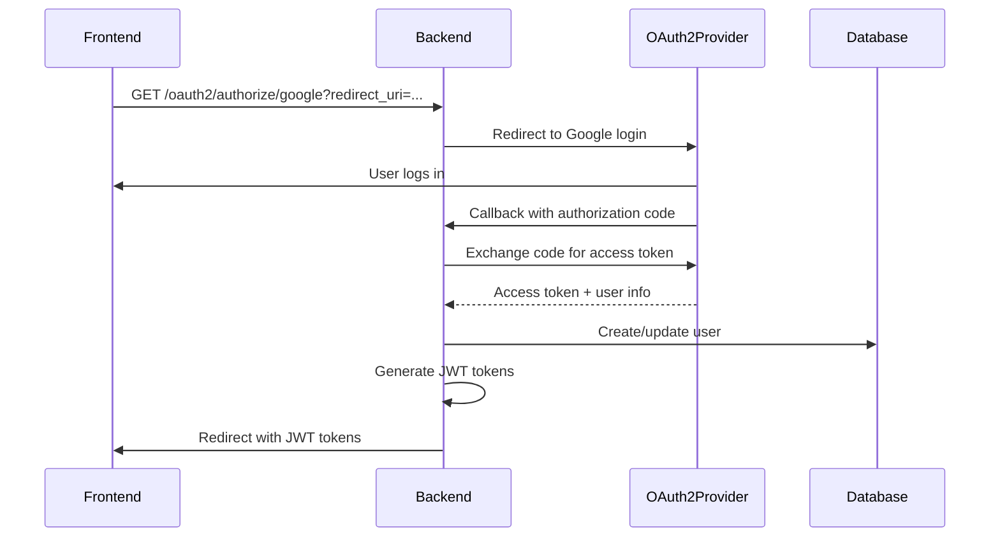

# 🍔 Shopee Food Authentication System Documentation

## 📋 Tổng quan

Hệ thống authentication của Shopee Food được xây dựng trên Spring Boot với tích hợp OAuth2 và JWT, hỗ trợ đăng nhập bằng email/password truyền thống và social login (Google, Facebook, GitHub).

### 🎯 Tính năng chính

- ✅ **Local Authentication** (Email/Password)
- ✅ **OAuth2 Social Login** (Google, Facebook, GitHub)
- ✅ **JWT Access & Refresh Tokens**
- ✅ **Email Verification**
- ✅ **Password Reset**
- ✅ **Rate Limiting**
- ✅ **Role-based Access Control**
- ✅ **Account Management**

---

## 🏗️ Kiến trúc hệ thống

### 📁 Cấu trúc thư mục

```
src/main/java/com/example/backend_api/
├── api/
│   └── AuthApi.java                    # REST API endpoints
├── config/
│   ├── SecurityConfig.java             # Spring Security configuration
│   ├── JwtAuthenticationFilter.java    # JWT filter
│   ├── CustomUserDetailsService.java   # User details service
│   ├── CustomOAuth2UserService.java    # OAuth2 user service
│   ├── OAuth2UserInfoFactory.java      # OAuth2 user info factory
│   ├── OAuth2AuthenticationSuccessHandler.java
│   ├── OAuth2AuthenticationFailureHandler.java
│   └── HttpCookieOAuth2AuthorizationRequestRepository.java
├── service/
│   ├── AuthService.java                # Business logic
│   ├── JwtService.java                 # JWT utilities
│   └── EmailService.java               # Email service
├── model/
│   ├── request/                        # Request DTOs
│   ├── response/                       # Response DTOs
│   └── enums/                         # Enums
├── entity/                            # JPA Entities
├── repository/                        # Data repositories
├── exception/                         # Custom exceptions
└── util/
    └── CookieUtils.java               # Cookie utilities
```

### 🔄 Luồng hoạt động

```mermaid
graph TD
    A[Client Request] --> B{Authentication Type}
    B -->|Local Login| C[Email/Password]
    B -->|OAuth2| D[Social Login]
    
    C --> E[AuthService.login()]
    D --> F[OAuth2Service]
    
    E --> G[Generate JWT]
    F --> H[Process OAuth2 User]
    H --> G
    
    G --> I[Return AuthResponse]
    I --> J[Client stores tokens]
```

---

## 🔐 JWT Authentication

### 🏷️ Token Structure

#### Access Token
- **Expiration:** 24 giờ (86400000ms)
- **Purpose:** Xác thực API requests
- **Claims:** userId, email, fullName, roles

#### Refresh Token
- **Expiration:** 7 ngày (604800000ms)
- **Purpose:** Gia hạn access token
- **Claims:** userId, tokenType

### 🔧 JWT Service

```java
// Generate access token
String accessToken = jwtService.generateAccessToken(user);

// Generate refresh token
String refreshToken = jwtService.generateRefreshToken(user);

// Validate token
boolean isValid = jwtService.validateToken(token);

// Extract user info
String email = jwtService.extractUsername(token);
Long userId = jwtService.extractUserId(token);
```

### 🛡️ JWT Filter Flow



---

## 🌐 OAuth2 Integration

### 🔧 Supported Providers

#### 1. Google OAuth2
```properties
spring.security.oauth2.client.registration.google.client-id=your-google-client-id
spring.security.oauth2.client.registration.google.client-secret=your-google-client-secret
spring.security.oauth2.client.registration.google.scope=email,profile
```

#### 2. Facebook OAuth2
```properties
spring.security.oauth2.client.registration.facebook.client-id=your-facebook-app-id
spring.security.oauth2.client.registration.facebook.client-secret=your-facebook-app-secret
spring.security.oauth2.client.registration.facebook.scope=email,public_profile
```

#### 3. GitHub OAuth2
```properties
spring.security.oauth2.client.registration.github.client-id=your-github-client-id
spring.security.oauth2.client.registration.github.client-secret=your-github-client-secret
spring.security.oauth2.client.registration.github.scope=user:email,read:user
```

### 🔄 OAuth2 Login Flow



### 🔍 OAuth2 User Processing

```java
@Service
public class CustomOAuth2UserService extends DefaultOAuth2UserService {
    
    @Override
    public OAuth2User loadUser(OAuth2UserRequest request) {
        OAuth2User oAuth2User = super.loadUser(request);
        
        // Extract user info based on provider
        OAuth2UserInfo userInfo = OAuth2UserInfoFactory
            .getOAuth2UserInfo(registrationId, oAuth2User.getAttributes());
        
        // Create or update user
        User user = processOAuth2User(userInfo);
        
        return CustomUserPrincipal.create(user, oAuth2User.getAttributes());
    }
}
```

---

## 📧 Email System

### 📬 Email Templates

#### 1. Email Verification
- **Subject:** "Xác thực tài khoản Shopee Food"
- **Template:** HTML với button xác thực
- **Expiry:** 24 giờ

#### 2. Password Reset
- **Subject:** "Reset mật khẩu Shopee Food"
- **Template:** HTML với button reset
- **Expiry:** 1 giờ

#### 3. Welcome Email
- **Subject:** "Chào mừng đến với Shopee Food!"
- **Template:** HTML welcome message
- **Trigger:** Sau khi verify email thành công

### 🔧 Email Configuration

```properties
# Gmail SMTP
spring.mail.host=smtp.gmail.com
spring.mail.port=587
spring.mail.username=your-email@gmail.com
spring.mail.password=your-app-password
spring.mail.properties.mail.smtp.auth=true
spring.mail.properties.mail.smtp.starttls.enable=true
```

---

## 🚪 API Endpoints

### 🔐 Authentication Endpoints

| Method | Endpoint | Description | Authentication |
|--------|----------|-------------|----------------|
| POST | `/api/auth/login` | Đăng nhập bằng email/password | ❌ |
| POST | `/api/auth/register` | Đăng ký tài khoản mới | ❌ |
| POST | `/api/auth/logout` | Đăng xuất | ✅ |
| POST | `/api/auth/refresh-token` | Gia hạn access token | ❌ |
| POST | `/api/auth/forgot-password` | Gửi email reset password | ❌ |
| POST | `/api/auth/reset-password` | Reset password với token | ❌ |
| GET | `/api/auth/verify-email?token=xxx` | Xác thực email | ❌ |
| POST | `/api/auth/resend-verification` | Gửi lại email xác thực | ❌ |
| GET | `/api/auth/validate-token` | Kiểm tra token hợp lệ | ✅ |

### 🌐 OAuth2 Endpoints

| Method | Endpoint | Description |
|--------|----------|-------------|
| GET | `/oauth2/authorize/google` | Bắt đầu Google OAuth2 |
| GET | `/oauth2/authorize/facebook` | Bắt đầu Facebook OAuth2 |
| GET | `/oauth2/authorize/github` | Bắt đầu GitHub OAuth2 |
| GET | `/login/oauth2/code/google` | Google OAuth2 callback |
| GET | `/login/oauth2/code/facebook` | Facebook OAuth2 callback |
| GET | `/login/oauth2/code/github` | GitHub OAuth2 callback |

---

## 📝 Request/Response Examples

### 1. Login Request

```json
POST /api/auth/login
Content-Type: application/json

{
  "email": "user@example.com",
  "password": "password123",
  "rememberMe": false
}
```

**Response:**
```json
{
  "accessToken": "eyJhbGciOiJIUzUxMiJ9...",
  "refreshToken": "eyJhbGciOiJIUzUxMiJ9...",
  "tokenType": "Bearer",
  "expiresIn": 86400,
  "user": {
    "id": 1,
    "email": "user@example.com",
    "fullName": "John Doe",
    "phoneNumber": "+84123456789",
    "avatar": "https://example.com/avatar.jpg",
    "emailVerified": true,
    "isActive": true,
    "roles": ["USER"],
    "createdAt": "2025-01-01T00:00:00",
    "lastLoginAt": "2025-01-01T12:00:00"
  }
}
```

### 2. Register Request

```json
POST /api/auth/register
Content-Type: application/json

{
  "fullName": "John Doe",
  "email": "john@example.com",
  "password": "Password123",
  "confirmPassword": "Password123",
  "phoneNumber": "+84123456789",
  "address": "123 Main St, Ho Chi Minh City"
}
```

**Response:**
```json
{
  "message": "Đăng ký thành công! Vui lòng kiểm tra email để xác thực tài khoản.",
  "data": 1
}
```

### 3. Refresh Token Request

```json
POST /api/auth/refresh-token
Content-Type: application/json

{
  "refreshToken": "eyJhbGciOiJIUzUxMiJ9..."
}
```

### 4. Forgot Password Request

```json
POST /api/auth/forgot-password
Content-Type: application/json

{
  "email": "user@example.com"
}
```

### 5. Reset Password Request

```json
POST /api/auth/reset-password
Content-Type: application/json

{
  "token": "uuid-token-here",
  "newPassword": "NewPassword123",
  "confirmPassword": "NewPassword123"
}
```

---

## 🔒 Security Configuration

### 🛡️ Security Rules

```java
.authorizeHttpRequests(authz -> authz
    // Public endpoints
    .requestMatchers("/api/auth/**").permitAll()
    .requestMatchers("/oauth2/**").permitAll()
    .requestMatchers("/login/oauth2/**").permitAll()
    
    // Public read endpoints
    .requestMatchers(HttpMethod.GET, "/api/products/**").permitAll()
    .requestMatchers(HttpMethod.GET, "/api/categories/**").permitAll()
    
    // Admin endpoints
    .requestMatchers("/api/admin/**").hasRole("ADMIN")
    
    // Shop owner endpoints
    .requestMatchers("/api/shop-owner/**").hasRole("SHOP_OWNER")
    
    // User endpoints
    .requestMatchers("/api/user/**").hasRole("USER")
    .requestMatchers("/api/orders/**").authenticated()
    
    // All other requests must be authenticated
    .anyRequest().authenticated()
)
```

### 🌐 CORS Configuration

```java
@Bean
public CorsConfigurationSource corsConfigurationSource() {
    CorsConfiguration configuration = new CorsConfiguration();
    
    configuration.setAllowedOriginPatterns(Arrays.asList(
        "http://localhost:3000",      // React development
        "http://localhost:3001",      // React production
        "https://shopee-food.com",    // Production domain
        "https://*.shopee-food.com"   // Subdomains
    ));
    
    configuration.setAllowedMethods(Arrays.asList(
        "GET", "POST", "PUT", "DELETE", "OPTIONS", "PATCH"
    ));
    configuration.setAllowedHeaders(Arrays.asList("*"));
    configuration.setAllowCredentials(true);
    
    return source;
}
```

---

## 🚨 Error Handling

### 📋 Error Codes

| Code | HTTP Status | Description |
|------|-------------|-------------|
| AUTH_001 | 401 | Invalid Credentials |
| AUTH_002 | 423 | Account Locked |
| AUTH_003 | 429 | Rate Limit Exceeded |
| AUTH_004 | 401 | Token Expired |
| AUTH_005 | 403 | Access Denied |
| AUTH_006 | 401 | Authentication Failed |
| AUTH_007 | 403 | Email Not Verified |
| AUTH_008 | 401 | Invalid Token |
| AUTH_009 | 409 | Duplicate Resource |
| AUTH_010 | 403 | Account Disabled |
| AUTH_011 | 403 | Insufficient Permission |
| AUTH_012 | 401 | OAuth2 Authentication Failed |

### 🔍 Error Response Format

```json
{
  "status": 401,
  "error": "Invalid Credentials",
  "message": "Email hoặc mật khẩu không đúng",
  "code": "AUTH_001",
  "path": "/api/auth/login",
  "timestamp": 1703980800000,
  "traceId": "abc-123-def"
}
```

---

## 🛠️ Setup & Configuration

### 1. 📋 Prerequisites

- Java 17+
- MySQL 8.0+
- Maven 3.6+
- Gmail account (for SMTP)
- OAuth2 provider accounts (Google, Facebook, GitHub)

### 2. 🗄️ Database Setup

```sql
-- Tạo database
CREATE DATABASE shopee_food CHARACTER SET utf8mb4 COLLATE utf8mb4_unicode_ci;

-- Tạo user (optional)
CREATE USER 'shopee_food_user'@'localhost' IDENTIFIED BY 'your_password';
GRANT ALL PRIVILEGES ON shopee_food.* TO 'shopee_food_user'@'localhost';
FLUSH PRIVILEGES;
```

### 3. ⚙️ Application Properties

```properties
# Database
spring.datasource.url=jdbc:mysql://localhost:3306/shopee_food
spring.datasource.username=root
spring.datasource.password=your_password

# JWT
app.jwt.secret=your-secret-key-minimum-256-bits
app.jwt.access-token-expiration=86400000
app.jwt.refresh-token-expiration=604800000

# Email
spring.mail.username=your-email@gmail.com
spring.mail.password=your-app-password

# OAuth2 - Google
spring.security.oauth2.client.registration.google.client-id=your-google-client-id
spring.security.oauth2.client.registration.google.client-secret=your-google-client-secret

# OAuth2 - Facebook
spring.security.oauth2.client.registration.facebook.client-id=your-facebook-app-id
spring.security.oauth2.client.registration.facebook.client-secret=your-facebook-app-secret

# OAuth2 - GitHub
spring.security.oauth2.client.registration.github.client-id=your-github-client-id
spring.security.oauth2.client.registration.github.client-secret=your-github-client-secret
```

### 4. 🔧 OAuth2 Provider Setup

#### Google Console
1. Truy cập [Google Cloud Console](https://console.cloud.google.com/)
2. Tạo project mới hoặc chọn project có sẵn
3. Enable Google+ API
4. Tạo OAuth 2.0 Client IDs
5. Thêm Authorized redirect URIs:
   - `http://localhost:8080/login/oauth2/code/google`
   - `https://yourdomain.com/login/oauth2/code/google`

#### Facebook Developers
1. Truy cập [Facebook Developers](https://developers.facebook.com/)
2. Tạo app mới
3. Add Facebook Login product
4. Cấu hình Valid OAuth Redirect URIs:
   - `http://localhost:8080/login/oauth2/code/facebook`
   - `https://yourdomain.com/login/oauth2/code/facebook`

#### GitHub
1. Truy cập GitHub Settings > Developer settings > OAuth Apps
2. Tạo New OAuth App
3. Cấu hình Authorization callback URL:
   - `http://localhost:8080/login/oauth2/code/github`

### 5. 📧 Gmail Setup

1. Bật 2-Factor Authentication cho Gmail
2. Tạo App Password:
   - Google Account > Security > 2-Step Verification > App passwords
   - Chọn "Mail" và thiết bị của bạn
   - Copy app password và sử dụng trong `spring.mail.password`

---

## 🧪 Testing

### 🔧 Test với Postman

#### 1. Test Local Login

```bash
curl -X POST http://localhost:8080/api/auth/login \
  -H "Content-Type: application/json" \
  -d '{
    "email": "test@example.com",
    "password": "password123"
  }'
```

#### 2. Test Protected Endpoint

```bash
curl -X GET http://localhost:8080/api/user/profile \
  -H "Authorization: Bearer your-jwt-token"
```

#### 3. Test OAuth2 Flow

1. Mở browser và truy cập:
   ```
   http://localhost:8080/oauth2/authorize/google?redirect_uri=http://localhost:3000/oauth2/redirect
   ```

2. Đăng nhập với Google

3. Kiểm tra redirect URL có chứa tokens

### 🐛 Debug Tips

#### 1. Enable Debug Logging

```properties
logging.level.com.example.backend_api=DEBUG
logging.level.org.springframework.security=DEBUG
logging.level.org.springframework.security.oauth2=TRACE
```

#### 2. Common Issues

- **JWT Token không hợp lệ:** Kiểm tra secret key và thời gian hết hạn
- **OAuth2 callback lỗi:** Kiểm tra redirect URI trong provider settings
- **Email không gửi được:** Kiểm tra Gmail app password và SMTP settings
- **CORS errors:** Kiểm tra allowed origins trong CORS configuration

---

## 🚀 Production Deployment

### 🔒 Security Checklist

- [ ] Sử dụng HTTPS cho tất cả endpoints
- [ ] JWT secret key đủ mạnh (256+ bits)
- [ ] Database credentials được bảo mật
- [ ] OAuth2 secrets được bảo mật
- [ ] Rate limiting được bật
- [ ] Logging sensitive data được tắt
- [ ] CORS origins được giới hạn
- [ ] Security headers được cấu hình

### 🌍 Environment Variables

```bash
# Database
DB_URL=jdbc:mysql://prod-db:3306/shopee_food
DB_USER=prod_user
DB_PASS=secure_password

# JWT
JWT_SECRET=your-production-secret-key-minimum-256-bits
JWT_ACCESS_EXPIRATION=86400000
JWT_REFRESH_EXPIRATION=604800000

# Email
MAIL_USER=noreply@shopee-food.com
MAIL_PASS=secure_app_password

# OAuth2
GOOGLE_CLIENT_ID=prod-google-client-id
GOOGLE_CLIENT_SECRET=prod-google-client-secret
FACEBOOK_CLIENT_ID=prod-facebook-app-id
FACEBOOK_CLIENT_SECRET=prod-facebook-app-secret
GITHUB_CLIENT_ID=prod-github-client-id
GITHUB_CLIENT_SECRET=prod-github-client-secret

# App URLs
FRONTEND_URL=https://shopee-food.com
AUTHORIZED_REDIRECT_URIS=https://shopee-food.com/oauth2/redirect,https://admin.shopee-food.com/oauth2/redirect
```

### 📊 Monitoring

#### Health Check Endpoint
```java
@GetMapping("/api/health")
public ResponseEntity<Map<String, String>> health() {
    Map<String, String> status = new HashMap<>();
    status.put("status", "UP");
    status.put("timestamp", LocalDateTime.now().toString());
    return ResponseEntity.ok(status);
}
```

#### Metrics to Monitor
- Login success/failure rates
- Token expiration rates
- OAuth2 callback success rates
- Email delivery rates
- Rate limiting hits
- Database connection pool status

---

## 📚 Additional Resources

### 🔗 Documentation Links

- [Spring Security OAuth2](https://docs.spring.io/spring-security/reference/servlet/oauth2/index.html)
- [JWT.io](https://jwt.io/) - JWT debugger
- [Google OAuth2](https://developers.google.com/identity/protocols/oauth2)
- [Facebook Login](https://developers.facebook.com/docs/facebook-login/)
- [GitHub OAuth2](https://docs.github.com/en/developers/apps/building-oauth-apps)

### 🛠️ Tools

- **Postman** - API testing
- **JWT.io** - JWT token debugging
- **MailHog** - Email testing (development)
- **Redis** - Session storage (optional)
- **Prometheus + Grafana** - Monitoring

---

## 🤝 Support

Nếu bạn gặp vấn đề hoặc có câu hỏi về hệ thống authentication:

1. **Kiểm tra logs** để xem chi tiết lỗi
2. **Verify configuration** trong application.properties
3. **Test với Postman** để isolate issues
4. **Check database** để đảm bảo data integrity

**Contact:** Tạo issue trong repository hoặc liên hệ development team.

---

*Tài liệu này được cập nhật lần cuối: 26/06/2025*
